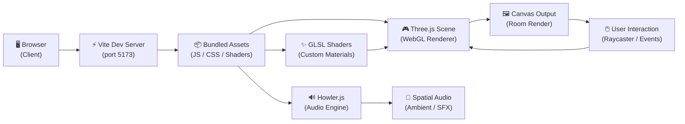
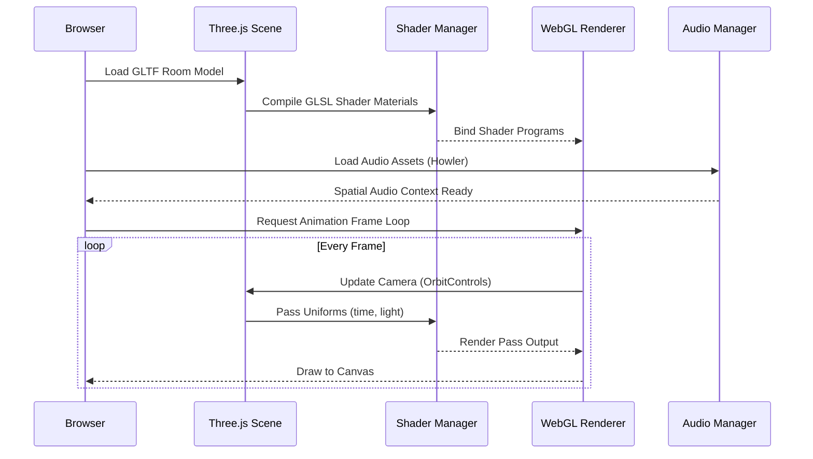

# 💜 수아's Award-Winning Room Folio 💜
> A 3D interactive WebGL portfolio — explore a virtual room built with Three.js, custom GLSL shaders, GSAP animations, and spatial audio.
**[Live site](http://sooahs-room-folio.com/)**

This repo contains code of 수아's Room Folio. If you're interested, learn how to create a porfolio like this [here]()!! It's beginner friendly!
---

## 🎯 Banner Placeholder
  
---

## 📊 Status Badges

```
License      |  MIT
Build        |  Vite + Three.js 0.172
Frontend     |  WebGL / GLSL / GSAP / Sass
Audio        |  Howler.js 2.2.4
Animation    |  GSAP 3.12
Platform     |  Single-page (Client-only, no backend)
```

---

## 🖼️ Visual Demo

```
[ Screenshot: Full room view — placeholder: public/media/og-image.webp ]
[ Screenshot: Interactive hotspots highlighted ]
[ Screenshot: Mobile responsive view ]
```

---

## 🏗️ System Design & Architecture

This project is a **client-only 3D WebGL application**. There is no backend server — all rendering, animation, and interactivity happen in the browser using WebGL via Three.js. Asset loading, shader compilation, and audio playback are handled directly in the browser runtime.

### Architecture Overview



### Rendering Pipeline



### Key Systems

| System | Technology | Role |
|---|---|---|
| **Rendering** | Three.js + WebGL | 3D scene graph, GLTF loading, PBR materials |
| **Shaders** | Custom GLSL (via vite-plugin-glsl) | Smoke, theme, and post-processing effects |
| **Animation** | GSAP | Hover tweens, intro sequences, camera transitions |
| **Audio** | Howler.js | Background music, UI click SFX, piano samples |
| **Styling** | Sass + include-media | Responsive layout, UI overlays |
| **Build** | Vite | Fast HMR, GLSL import, asset bundling |

---

## 💻 Tech Stack

### Frontend

```
Three.js          0.172.0    3D rendering engine
GSAP              3.12.7     Animation & tweening
Howler.js        2.2.4      Audio playback
Sass             1.83.4     SCSS styling
Vite             6.0.5      Build tool & dev server
vite-plugin-glsl 1.3.1      GLSL shader imports
glslify-loader   2.0.0      Shader transpilation
```

### Backend

> **N/A** — This is a client-only project. No server, API, or database is required.

---

## ⚙️ How It Works (Under the Hood)

### 1. Scene Initialization

On page load, `main.js` initializes a Three.js scene, sets up the WebGL renderer, and begins loading external assets:

- **GLTF Room Model** — loaded via `GLTFLoader` from `public/models/`
- **Textures** — loaded from `public/textures/` (PBR maps: albedo, normal, roughness)
- **Audio Files** — loaded via Howler from `public/audio/`
- **Fonts** — loaded from `public/fonts/`

### 2. Shader Compilation

Custom GLSL shaders live in `src/shaders/` (smoke, theme effects) and are compiled at runtime via `vite-plugin-glsl`. These are injected into Three.js `ShaderMaterial` instances on specific meshes (e.g., the smoke overlay, wall materials).

### 3. Animation System

GSAP handles all tweened animations:

- **Intro Animation** — Camera flies into the room on first load
- **Hover Interactions** — Objects scale/rotate when hovered via raycasting
- **Hitbox Management** — Static objects use their own geometry for raycasting; animated objects use generated invisible hitboxes to prevent "vibration" bugs (see Known Issues)

### 4. Raycasting & Interaction

Three.js `Raycaster` detects which mesh the cursor is pointing at. On hover, GSAP tweens play. On click, audio SFX fire and camera may transition.

### 5. Audio Layer

Howler.js manages:

- Background ambient music (looped, with fade-in)
- UI click sound effects
- Piano sample playback for interactive objects

---

## 🚀 Getting Started

### Prerequisites

| Requirement | Version | Notes |
|---|---|---|
| **Node.js** | >= 18.x | Required for Vite |
| **npm** | >= 9.x | Comes with Node |

No database, external API, or backend service is required.

### Installation

```bash
# Clone the repository
git clone https://github.com/your-username/sooahkimsfolio.git
cd sooahkimsfolio

# Install all dependencies
npm install
```

### Running Locally

```bash
# Start Vite dev server with hot reload
npm run dev
# Opens at http://localhost:5173
```

### Building for Production

```bash
# Build optimized bundle to /dist
npm run build

# Preview production build locally
npm run preview
```

### Environment Variables

> This project does **not** require any `.env` files. It is a fully static client-side application.

If you add third-party services (analytics, fonts, etc.), create `.env` in the root:

```env
# Example: Google Analytics (replace with your own keys)
VITE_GA_ID=G-XXXXXXXXXX
```

---

## 📁 Folder Structure

```
sooahs-room-folio/
├── public/                        # Static assets (served as-is)
│   ├── audio/                     # Background music, SFX, piano samples
│   ├── draco/                     # Draco decoder files (GLTF compression)
│   ├── fonts/                     # Self-hosted web fonts
│   ├── images/                    # UI overlay images, icons
│   ├── media/                     # OG image, promotional assets
│   ├── models/                    # GLTF/GLB 3D room model
│   ├── shaders/                   # Standalone GLSL shader files
│   └── textures/                  # PBR texture maps
│
├── src/                           # Source code (compiled by Vite)
│   ├── main.js                    # Entry point — scene init, loaders, loop
│   ├── style.scss                 # Root SCSS entry point
│   │
│   ├── shaders/                   # Project-specific GLSL shaders
│   │   ├── includes/              # Reusable GLSL snippets
│   │   ├── smoke/                 # Smoke / particle shader
│   │   └── theme/                 # Theme-reactive shader
│   │
│   ├── styles/                    # SCSS partials
│   │   ├── defaults.scss          # Base element styles
│   │   ├── fonts.scss             # Font face declarations
│   │   ├── reset.scss            # CSS reset
│   │   └── variables.scss         # CSS custom properties (colors, spacing)
│   │
│   └── utils/                     # Utility modules
│       └── OrbitControls.js       # Camera orbit logic (customized)
│
├── index.html                     # HTML entry point
├── package.json                   # Dependencies & scripts
├── vite.config.js                 # Vite configuration (GLSL plugin, etc.)
└── README.md
```

---

## 🔮 Future Scope

- [ ] Add user-configurable room themes (day/night/warm/cold)
- [ ] Integrate a CMS (e.g., Sanity or Contentful) for editable hotspot content
- [ ] Add WebXR support for VR headset exploration
- [ ] Implement multiplayer "visit" feature via WebSocket presence
- [ ] Expand audio to positional/spatial sound per object

---

## 🌐 API Endpoints

> **N/A** — This project has no backend API. All content is embedded in the client bundle.
> If you add a backend in the future, routes would follow this pattern:

| Method | Route | Description |
|---|---|---|
| `GET` | `/api/v1/room/config` | Room configuration JSON |
| `GET` | `/api/v1/asset/:id` | Signed asset URL |
| `POST` | `/api/v1/analytics/event` | Track user interaction |

---

## 🫶 Contributing

Contributions are welcome! To get started:

1. **Fork** the repository
2. **Create a feature branch**: `git checkout -b feature/your-feature-name`
3. **Commit your changes**: `git commit -m 'Add some feature'`
4. **Push to the branch**: `git push origin feature/your-feature-name`
5. **Open a Pull Request**

When opening a PR, please:

- Describe what changed and why
- Attach screenshots for UI changes
- Ensure `npm run build` succeeds without errors

---

## 📜 License

This project is licensed under the **MIT License**. See [LICENSE.md](LICENSE.md) for details.

---

## 🏆 Awards

- [Awwwards — Site of the Day](https://www.awwwards.com/sites/suas-room-folio)
- [CSS Design Awards — Special Kudos](https://www.cssdesignawards.com/sites/sooahs-room-folio/47040/)

---

## ⚠️ Known Issues

> **Raycaster vibration on animated objects** — Hover animations on meshes with intro tweens can cause "vibration" at certain angles. This occurs because the animation displaces the mesh, causing the raycaster to lose contact, killing the tween, which allows the mesh to return — re-triggering the hover. **Workaround**: Use static invisible hitbox meshes for raycasting alongside the animated visual mesh.

> **.ogg audio on iOS/Safari** — `.ogg` audio files may not play on iPhones. Always provide `.mp3` fallback versions and conditionally load based on user agent detection via Howler's `usingWebAudio` check.

---

## 🙏 Credits & Inspiration

| Credit | Link |
|---|---|
| [Bruno Simon's Virtual Room](https://my-room-in-3d.vercel.app/) | Primary inspiration |
| [Rachel Wei's Portfolio](https://rachelqrwei.ca/) | Layout reference |
| [Nicky Blender](https://www.instagram.com/nicky.blender/) | Room model |
| [Wipart ArtStation](https://wipart.artstation.com/store) | Materials (commercial license) |
| [SVGrepo](https://www.svgrepo.com/) | SVG icons |
| [FontSpace — Niskala Huruf](https://www.fontspace.com/niskala-huruf) | Display font |
| Music: [YouTube](https://youtu.be/eq3C1Uwz6YU) | Background track |
| Piano SFX: [Pixabay](https://pixabay.com/sound-effects/all-88-keys-on-a-piano-playing-fast-free-high-quality-sound-effects-71279/) | Interactive audio |
